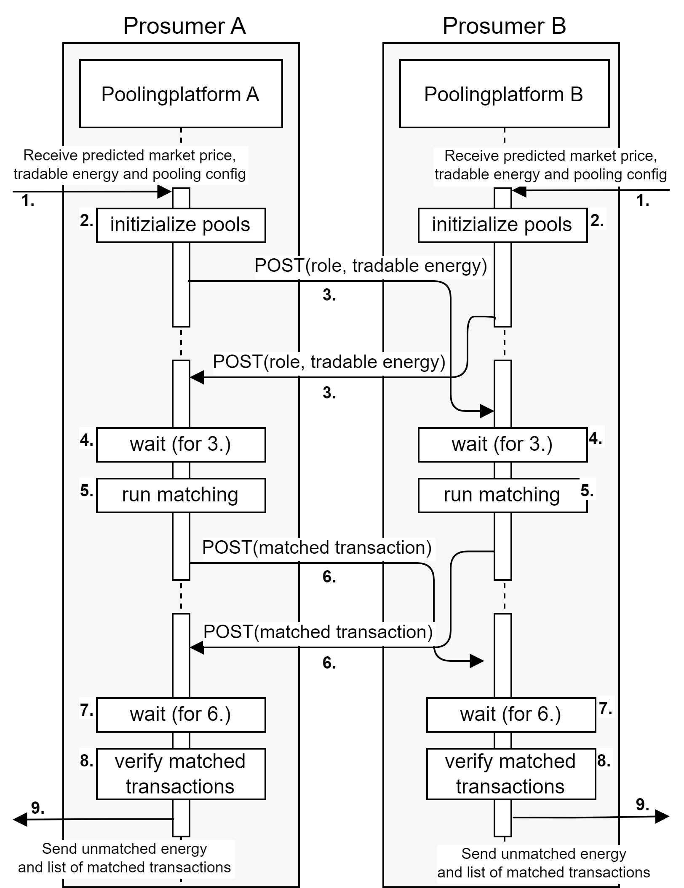

# BEST_PoolingPlatform

## Introduction

### Motivation
Local energy markets (LEMs) have been introduced in the last few decades as a bottom-up approach solution to create a competitive market for prosumers/consumers to trade their energy and have control over their energy sources. However, there is still a gap in research for prosumers/consumers willing to exchange energy at defined price- and energy-preferences. In this work, we propose an open-source LEM model - the so-called Pooling Platform - for matching prosumers and consumers with the same energy and price policy in a decentralized LEM. Our model was verified of its applicability by simulating it with the data from a German community.

### The Pooling Platform
The Pooling Platform is a component of the BEST system (still in development) that allows prosumers to trade energy with a predefined group of trading partners (e.g. family members, friends, local school etc) on a set of conditions that is agreed upon by all members of the pool. The aim of the trading within a pool is not economic benefit but altruistic sharing. The trading conditions include the price at which the energy is sold, which can either be fixed or a certain percentage of the predicted market price.


## Results
The simulation results showed that the model was able to satisfy the energy preferences of the consumers and prosumers in the local community to an average of more than 60%. Moreover, the model also demonstrated improved performance in terms of self-sufficiency and self-consumption ratio to the community compared to trading with the central LEM.


# Implementation notes

## Library requirements
aiohttp>=3.8.1
fastapi>=0.87.0
httpx>=0.23.0
matplotlib>=3.5.3
numpy>=1.23.4
pandas>=1.5.1
pydantic>=1.10.2
pymarket>=0.7.6
requests>=2.28.1
uvicorn>=0.19.0

These can be installed with:
```
pip install -r requirements.txt
```


## Files
The Pooling Platform contains the following files:

### Setup files:

**globalVars.py** - contains basic simulation parameters such as the date range for the data to be retrieved, the number of simulated time steps, and the number of simulation rounds. Of note, the length of each round is equal to the number of time steps and for each round one would need a different user preference configuration. The latter can be generated using the createCommunity.py.

**createCommunity.py** - contains the scripts to generate the community with a given number of parameters through generating the user preferences (pool energy allocation as prosumer and consumer) and retrieving the respective data from the dataset.

### Running files:

**libraryImports.py** - contains the shared imports for the files

**PoolingPlatform.py** - the core implementation of the pooling platform, the pools and the matching algorithms.

**fakeOBSd.py**, **fakeCommunityPlatform.py**, **fakeBiddingAgent.py** - files set up to imitate the information flow from the respective components of the BEST system. The information about the available tradeable energy is received from the OBSd, whereas the information about pool membership and the respective pool configurations is received from the community platform. In turn, the bidding agent provides the information about the market price of energy at each given timepoint.

**doubleAuctionFunctions.py**, **runDoubleAuction.py** - scripts to run the Uniform Price double action market using the Pymarket library

### Evaluation files:
**performanceMetrics.py** - contains the functions to calculate basic performance metrics such as self-sufficiency and self-consumption for each time step.

**analysis\dataAnalysis.py** - contains the functions to calculate average metrics per condition and per-pool metrics.

**analysis\plotResults.py** - contains the functions to plot the metrics. the output of the dataAnalysis.py might be needed for some of them.


# Running the experiments

## Data

All the data used in the simulation is already contained in the data folder and does not require additional downloads.

## Running the simulation

The basic parameters, such as the duration of the simulation, should be set in the ``globalVars`` file. Please note that the startDate and endDate parameters determine the date range for the data to be retrieved but not the duration of the simulation. The duration of the simulation within one round is defined by the noOfTimeslotsInRound parameter, starting with the startDate. The startDate setting may or may not include the starting time.

In addition, before running the simulation, the community settings have to be generated using the ``createCommunity.py`` script. It is not necessary to run it separately, as it is triggered every time ``poolingPlatform.py`` runs. However, if run for the first time, please set ``generateNewCommunitySetups`` to True to generate a new set of community settings. Afterwards, this parameter can be set to False, so that the user preference configurations can be reused.

In order to run the simulation, run ``poolingPlatform.py``. It will run it for all the combinations of community and trading setups specified in ``globalVars``. In order to produce the plots, first run the ``analysis\dataAnalysis.py`` and then ``analysis\plotResults.py``.


 


